# PBI-MoM-Ignorando-Meses-Nulos
Repositório para cálculos em DAX de MoM

Neste repositório o objetivo é abordar o cálculo de MoM (Month-Over-Month) com o objetivo de visualizar uma taxa de crescimento mensal de um determinado valor. Passei por essa situação em um projeto, e de modo a não revelar os dados, criei uma base de dados simples para demonstrar o cálculo. 

  

Nesta base, existem valores para uma determinada data. Desse modo, conseguimos calcular o percentual de MoM. 

Além desta tabela de fato, realizei a criação de uma tabela dimensão calendário apenas para facilitar o entendimento no decorrer deste exemplo. 

  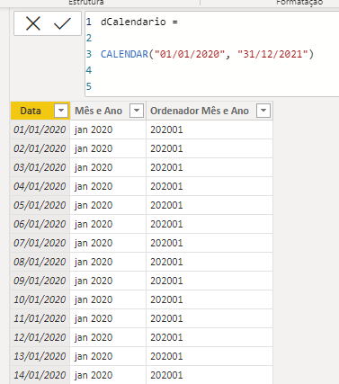

Essa tabela dimensão calendário tem apenas uma coluna de data, uma coluna de mês e ano e uma coluna de ordenação para que os meses e anos sejam ordenados da maneira correta.

Para então iniciar os cálculos, optei por criar uma medida denominada total, essa medida é a soma dos valores da tabela fato. 

  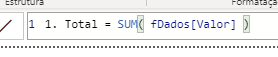

Após isso, foi criada uma tabela para visualização dos dados.

  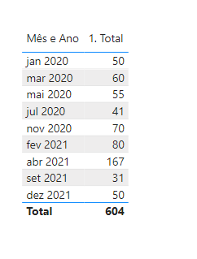

Até aí, tudo bem, a coluna de mês e ano da tabela dimensão teve os valores da tabela fato agregados a ela através da medida criada. 

A seguir, foi criada a medida MoM que denomino como MoM Tradicional: 

  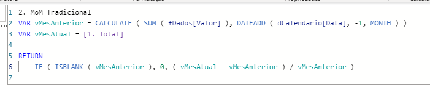

Então, vamos adicioná-la a tabela para visualizar o comportamento: 

  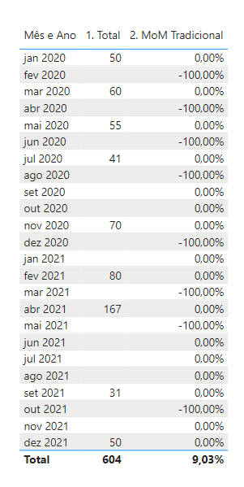

Este comportamento é considerado o padrão da medida e ao analisar profundamente, podemos observar que não há erros, retratando duas situações conforme exemplo: 
<ul>
  <li> Jun 2021 e Jul 2021 não possuem valores, logo, o percentual para Jul 2021 é 0%. </li>
  <li> Fev 2021 possui valor 80 Mar 2021 não possui valor, desse modo, o percentual para Mar 2021 é de 100%. </li>
</ul>
  
Embora esse comportamento seja padrão, matematicamente falando, para muitos analistas de negócio isso atrapalha a análise, desse modo, em um projeto que estou realizando, me foi solicitado ignorar os meses que não houveram um fato, isto é, não houveram uma transação de valores (considero essa ausência como NULL no SQL e BLANK() no Power BI). 

Para atender essa solicitação, foi necessário repensar uma lógica que vá de encontro com a realidade de negócio e dos dados. Como se trata de um tutorial, optei por dividir os cálculos realizados em etapas menores para facilitar o entendimento.

A primeira coisa, foi verificar qual foi a última data com valores existentes. Para isso, todos os cálculos foram realizados utilizando a data presente na tabela fato. 

  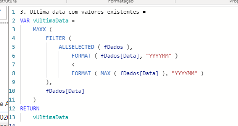

Desse modo, após a criação da medida acima, podemos observar o seguinte comportamento: 

  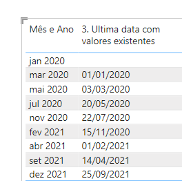

Basicamente, a medida navega entre os contextos do Power BI, para trazer uma data menor que a data do contexto atual que no caso, é um contexto de tabela (respeita os valores de cada linha).

Agora que temos as datas dos meses anteriores, torna-se necessário retornar os valores correspondentes a elas, como estou seguindo o contexto de mês e ano, o que me importa é realizar uma soma dentro de cada mês e ano. 

  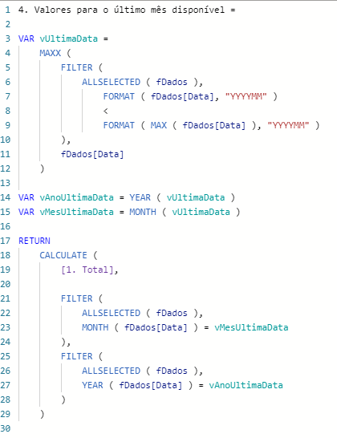

Após a criação desta medida, podemos observar o comportamento na tabela: 

Este é exatamente o comportamento desejado.

  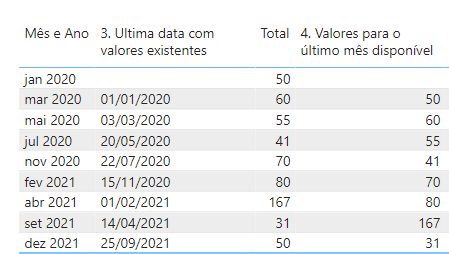

Por fim, basta realizar o cálculo entre os valores Total que é o atual e a medida criada. 

  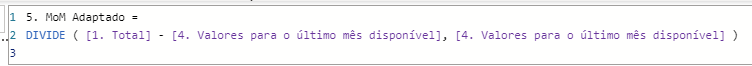

Desse modo, o comportamento final, será: 

  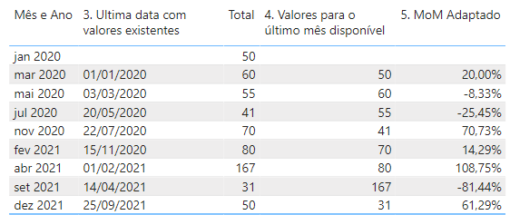

Por fim, conseguimos manipular os dados e os cálculos para criar as mais variadas visualizações, como por exemplo: 

  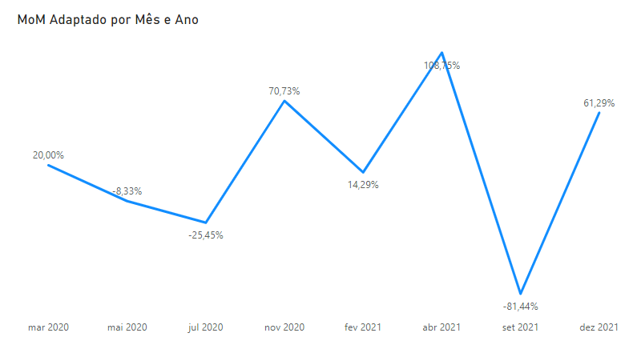

